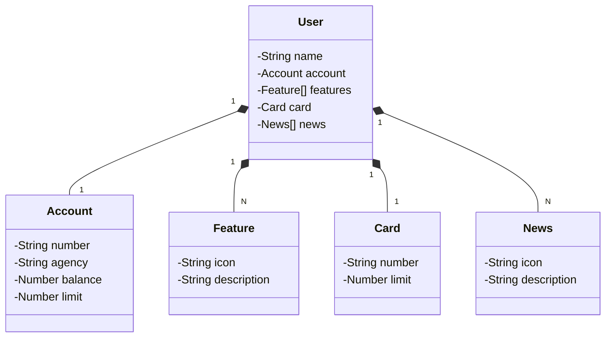

# API REST para Gerenciamento de Contas Bancárias

Esta é uma API REST desenvolvida em Java utilizando Spring, JPA (Java Persistence API), PostgreSQL como banco de dados e OpenAPI para documentação.

## Introdução
Este projeto visa fornecer uma solução para o gerenciamento de contas bancárias, permitindo operações como criar, atualizar, excluir, listar todos os usuários, contas, características (features), cartões e notícias (news).

## Entidades -  Diagrama

### O projeto consiste nas seguintes entidades:
- User: Representa os usuários do sistema.
- Account: Representa as contas bancárias associadas aos usuários.
- Feature: Características adicionais de uma conta bancária.
- Card: Representa os cartões associados às contas bancárias.
- News: Notícias relacionadas ao sistema bancário.

## Operações
### API suporta as seguintes operações para cada entidade

- ListAll: Listar todas as entidades.
- FindByUUID: Buscar uma entidade pelo seu UUID.
- Create: Criar uma nova entidade.
- Update: Atualizar uma entidade existente.
- Delete: Excluir uma entidade existente.

## Tecnologias Utilizadas
- Java: Linguagem de programação principal.
- Spring: Framework utilizado para desenvolvimento de aplicações Java.
- JPA (Java Persistence API): Especificação de API Java que descreve o gerenciamento de dados relacionais em aplicativos Java.
- PostgreSQL: Banco de dados relacional utilizado para armazenamento dos dados.
- OpenAPI: Utilizado para documentação da API.

## Configuração e Execução
1. Clone o repositório.
2. Certifique-se de ter o JDK e o Maven instalados em sua máquina.
3. Configure as propriedades do banco de dados PostgreSQL no arquivo `application.properties`.
4. Execute a aplicação utilizando o Maven: `mvn spring-boot:run`
5. Acesse a documentação da API em `http://localhost:8080/swagger-ui.html`.

## Contribuição
Sinta-se à vontade para contribuir com este projeto. Caso encontre algum problema ou tenha sugestões de melhorias, por favor, abra uma issue ou envie um pull request.

## Licença
Este projeto está licenciado sob a MIT License.

   
